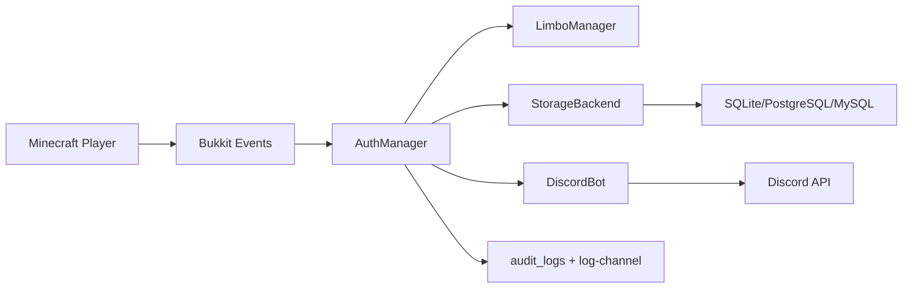

# Архитектура

## Слои

Allay Auth разделен на несколько слоев.

| Слой | Пакет | Назначение |
|---|---|---|
| Bootstrap | `dev.allayauth` | Жизненный цикл Bukkit plugin, регистрация сервисов |
| Auth domain | `auth` | Flow авторизации, limbo state, sessions |
| Scheduler | `scheduler` | Безопасный переход между async, global, entity и region execution |
| Discord | `discord` | JDA bot, slash-команды, interaction buttons |
| Storage | `storage` | Async repository API и JDBC backends |
| Config/lang | `config` | `config.yml`, MiniMessage языковые строки |
| Listeners | `listeners` | Bukkit event guards для limbo |
| Events/API | `events`, `api` | Интеграция с другими плагинами |
| GeoIP | `geoip` | Локальная MaxMind lookup-логика |
| Web | `web` | Optional HTTP health API |
| Utilities | `util` | Длительности, коды, IP hash, rate limit, формат времени |

## Почему есть `SchedulerAdapter`

Folia запрещает обращаться к игрокам и регионам с произвольных потоков. Даже на Paper полезно держать одно место, через которое код возвращается к Bukkit API.

`SchedulerAdapter` делает три вещи:

- определяет Folia через наличие `io.papermc.paper.threadedregions.RegionizedServer`;
- в Folia пытается вызвать global/entity/region schedulers через reflection;
- на Paper/Bukkit использует `BukkitScheduler` как fallback.

Reflection выбран осознанно: проект компилируется против Paper API и не требует отдельной Folia compile dependency.

## Почему storage async

JDBC блокирует поток, поэтому все методы `StorageBackend` возвращают `CompletableFuture`.

Auth-flow устроен так:

1. Bukkit event приходит на серверном потоке.
2. Игрок сразу переводится в limbo.
3. БД проверяется async.
4. Любое действие с игроком возвращается через `SchedulerAdapter.runForPlayer`.

## Почему Discord отдельно от AuthManager

`AuthManager` не должен знать детали JDA interaction lifecycle. Он принимает бизнес-решение: привязать, подтвердить, доверять IP, отклонить.

`DiscordBot` и listeners знают, как:

- зарегистрировать slash-команды;
- отправить DM;
- собрать Discord message text;
- разобрать `custom_id` кнопки;
- ответить ephemeral-сообщением.

## Почему LangManager везде

Minecraft-сообщения должны идти через MiniMessage. Discord-сообщения берут text labels из тех же lang-файлов там, где это пользовательский текст.

Это упрощает перевод и убирает `§`/`&` цветовые коды из Java-кода.

## Поток данных

## Важные инварианты

- В linked state главным ключом является UUID.
- Pending code не должен переживать успешную привязку.
- Button interaction должен проверять Discord ID владельца.
- Full IP не пишется в БД, если включен hash mode.
- Любой bypass должен попадать в audit log.
- Limbo не очищает реальный инвентарь.
