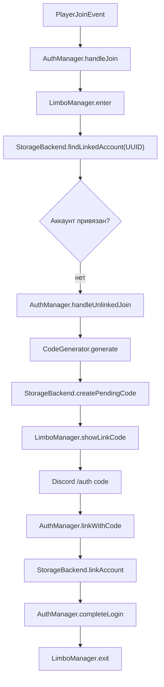
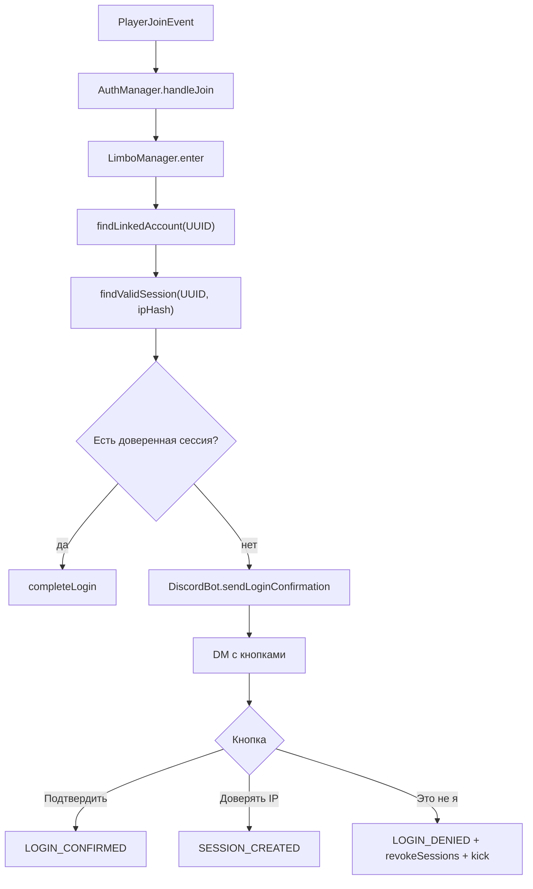

# Как работает авторизация

## Первый вход

Первый вход используется для привязки Minecraft UUID к Discord ID.



Что важно:

- код одноразовый;
- код хранится в `pending_auth_codes`;
- после успешной привязки код удаляется;
- UUID берется из `Player#getUniqueId`, ник сохраняется только как последний известный display identifier.

## Повторный вход

Повторный вход требует подтверждения через Discord DM.



## Почему limbo включается сразу

Игрок переводится в limbo до результата БД/Discord. Это защищает сервер от race condition: игрок не успевает двигаться, ломать блоки, писать в чат или открывать инвентарь, пока асинхронно проверяется linked state.

## Timeout

Для pending-входа создается отложенная задача:

- непривязанный игрок: timeout удаляет pending code;
- привязанный игрок: timeout кикает, пишет audit log и вызывает `AllayAuthTimeoutEvent`;
- если игрок вышел сам, pending state очищается в `handleQuit`.

## Trust IP

Кнопка `Доверять этому IP` создает запись в `login_sessions`.

IP в таблице хранится как `ip_hash`, если включено:

```yaml
security:
  hash-ip-in-database: true
```

Следующий вход с таким же IP до `expires_at` проходит автоматически.
